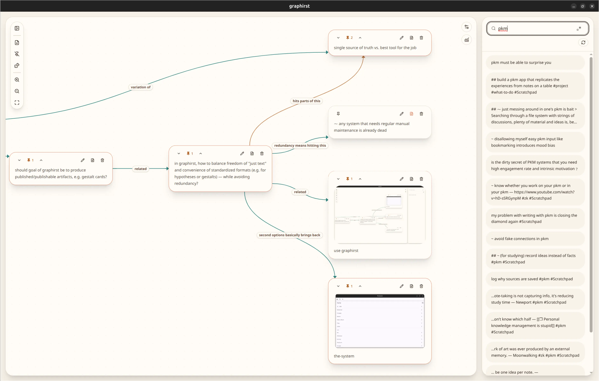

# graphirst

Plain-text notetaking with semantic relationships as a first-class citizen.



## Features & Advantages

> relations among ideas are far more important than the ideas themselves.

— Pierre Bayard, *How to Talk About Books You Haven't Read*

> If you just add links without any explanation you will not create knowledge. Your future self has no idea why he should follow the link

— [zettelkasten.de](https://zettelkasten.de/introduction/)


- **Connecting nodes with labeled edges is _the thing_**: Labeling relationships isn't just theoretically possible; and a graph of connections isn't just an afterthought for positing on social media 
- **Notes live as JSON files on your disk**. You can sync them freely with e.g. Syncthing or Google Cloud, build other frontends for them, feed them into LLMs, open them in an editor, run python script over them, ...
- **Tools to interact with your notes**: Includes a growing source of tools to not forget your notes — open random notes, orphans or search results w/o friction

## Tech

- React Native, using [React Flow](https://reactflow.dev/) for the renderer

Thus, use the standard js commands

```
npm i
npm run dev
npm run build
```

For some hints on how to install this, see the [justfile](/justfile).